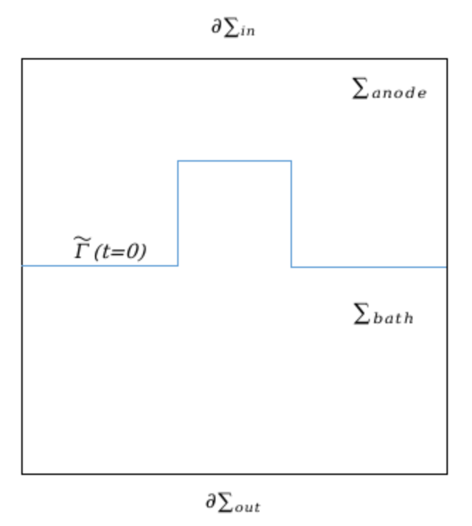

# AnodeConsumption

The two domains are separated by an interface $\tilde{\Gamma}(t) = \overline{\Sigma_{anode}(t)} \cap \overline{\Sigma_{bath}(t)}$, see Fig. 1.

<p align="center">
  
</p>

The mathematical model has been derived from equation (1), assuming the magnetic potential and the magnetic field to be zero. Given the unknown interface $\tilde{\Gamma}(t)$ between the anode and the bath, we search for the electric potential $V: \Sigma=\Sigma_{anode} \cup \Sigma_{bath} \times (0, T] \to \mathbb{R}$ such that,

$\nabla \cdot (\sigma \nabla V) = 0$ in $\Sigma$,

$\sigma \nabla V \cdot \mathbf{n} = \frac{I}{|\partial \Sigma_{in}|}$ on $\partial \Sigma_{in}$,

$\sigma \nabla V \cdot \mathbf{n} = -\frac{I}{|\partial \Sigma_{out}|}$ on $\partial \Sigma_{out}$,

$\sigma \nabla V \cdot \mathbf{n} = 0$ on $\partial \Sigma \setminus (\partial \Sigma_{in} \cup \partial \Sigma_{out})$,

$\{V\}_{\tilde{\Gamma}} = 0$ on $\tilde{\Gamma}(t)$,

${\sigma \nabla V \cdot \mathbf{n}}_{\tilde{\Gamma}} = 0$ on $\tilde{\Gamma}(t)$.


The conductivity $\sigma$ has a constant value in the two media $\sigma_{anode}$ and $\sigma_{bath}$. The interface can be parameterized with the level set function $\tilde{\varphi}$ as $\tilde{\Gamma}(t) = {\mathbf{x} \in \Sigma : \tilde{\varphi}(\mathbf{x}, t) = 0}$. The conductivity is then given by:

```math
\sigma(\tilde{\varphi}) = \sigma_{bath} + (\sigma_{anode} - \sigma_{bath}) H(\tilde{\varphi}),


